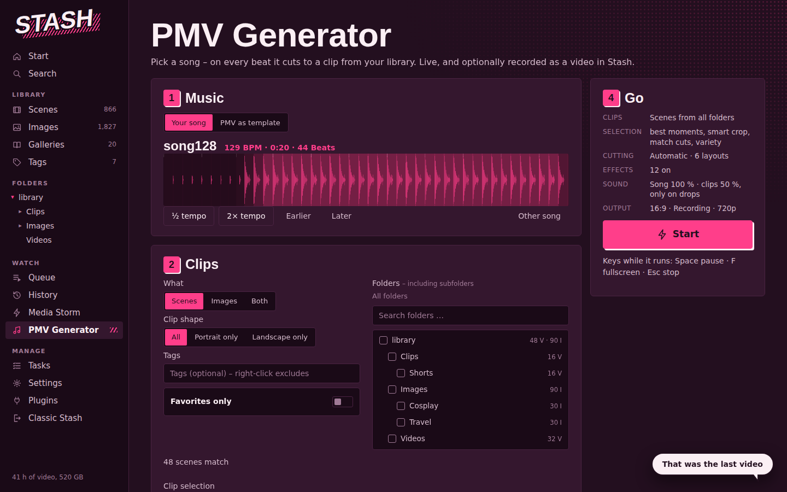
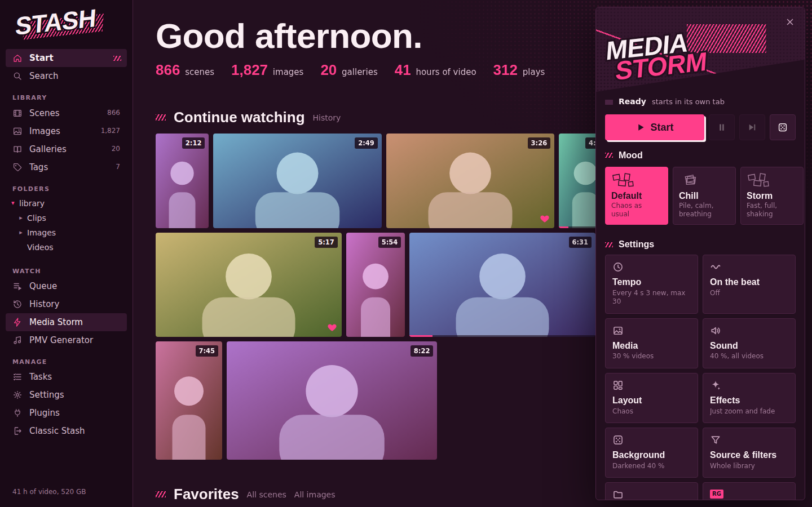
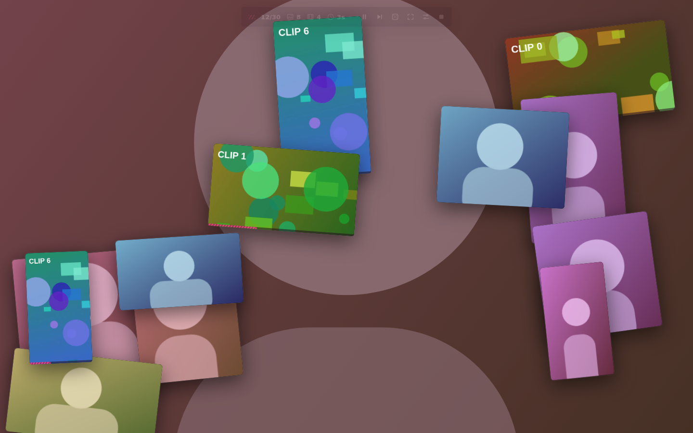
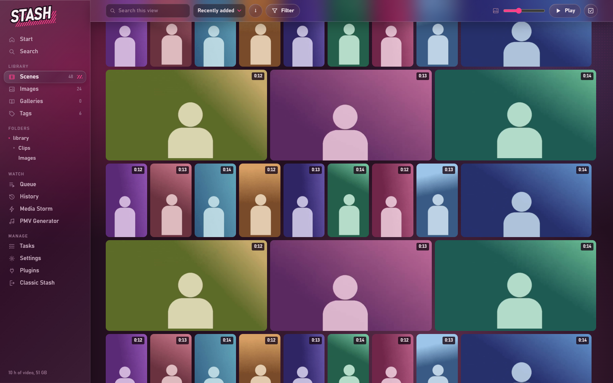
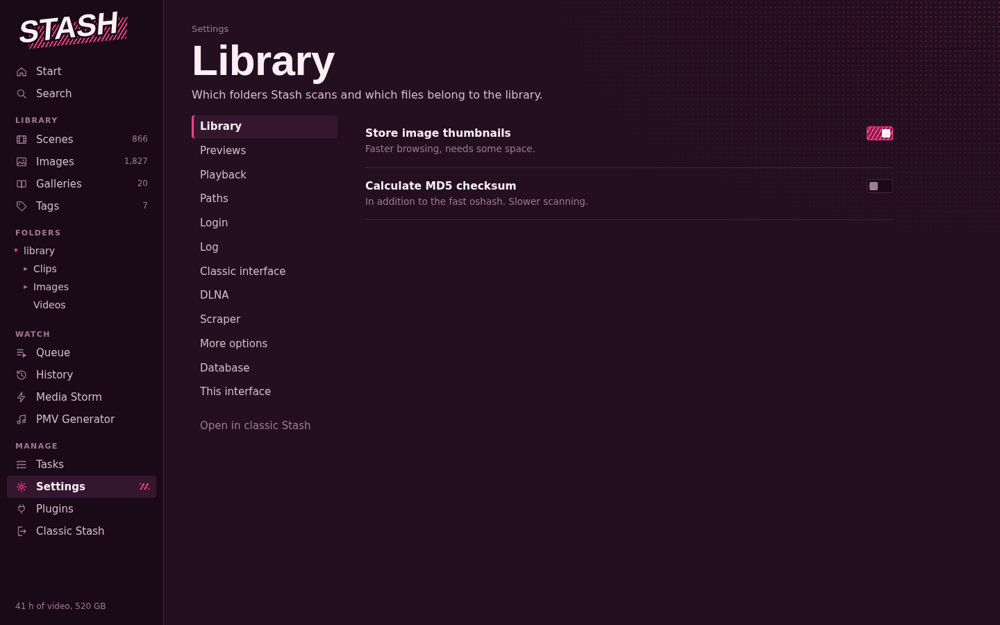

# Stash plugins: Stash UI, PMV Generator, Media Storm

Three plugins for [Stash](https://github.com/stashapp/stash).

| Plugin | What it is |
|---|---|
| [**PMV Generator**](plugins/pmvGenerator/README.md) | Pick a song – on every beat it cuts to a clip from your library, with split-screen layouts, effects, speed ramps and clip audio. Live in the browser, optionally recorded and saved back to Stash. Can also rebuild an existing PMV with your own clips. |
| [**Media Storm**](plugins/mediaStorm/README.md) | Random images and videos from your library appear in waves in their own tab – eight layouts, effects, moods, folder and tag filters, waves on the beat of a song. |
| [**Stash UI**](plugins/stashui/README.md) | A complete new interface for Stash in the Media Storm look: browsing, player with highlights and “similar”, image viewer, folders, tags, queue, tasks, all settings. Classic Stash stays available in the same look. |

Each plugin works on its own – install just the ones you want. They share the same look and work together: with Stash UI installed, Media Storm and the PMV Generator show up in its menu, and the PMV Generator leads back into Stash UI.

## Screenshots

| | |
|---|---|
|  |  |
|  |  |
|  |  |
|  |  |

*Screenshots use placeholder sample data and test clips.*

## Install

1. In Stash, open **Settings → Plugins → Available Plugins → Add Source**.
2. Name: anything you like. URL: `https://anonym88312.github.io/stash-pmv-plugins/index.yml`
3. The plugins appear in the list below – tick the ones you want and click **Install**.
4. Reload the Stash page.

Updates show up in the same place (**Check for Updates**).

Manual install: copy a folder from `plugins/` into your Stash plugins folder and click **Reload plugins** in Settings → Plugins.

### Requirements

- A recent Stash version and a current Chrome, Edge or Firefox.
- `python` in the PATH for the small backends: saving PMV Generator recordings to Stash, and the optional RedGifs features of Media Storm. Everything else runs in the browser.
- Optional: ffmpeg (Stash's own is used) so saved recordings get a proper duration.

## Development

- No build step for the code itself: plain JavaScript ES modules.
- Stash UI is the source of the shared basics (the CSS, `api.js`, `ui.js`, `pmvsmart.js`, the tag picker). The PMV Generator owns its own code (`pmvgen.js`, `beats.js`, `pmvfx.js`, `pmvscan.js`, `backend.py`); its `beats.js` is also used by Media Storm. After editing shared files, run `python tools/build.py --sync-only` – it copies them where they're needed and stamps versions against stale browser caches.
- `python tools/build.py` additionally writes the zips and `index.yml` to `dist/`. On every push to `main`, the GitHub Actions workflow builds them and publishes them with GitHub Pages (Settings → Pages → Source: **GitHub Actions**).

## License

[MIT](LICENSE)
