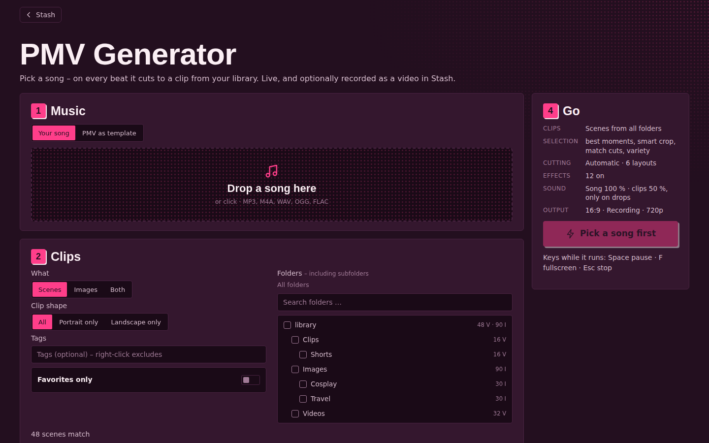
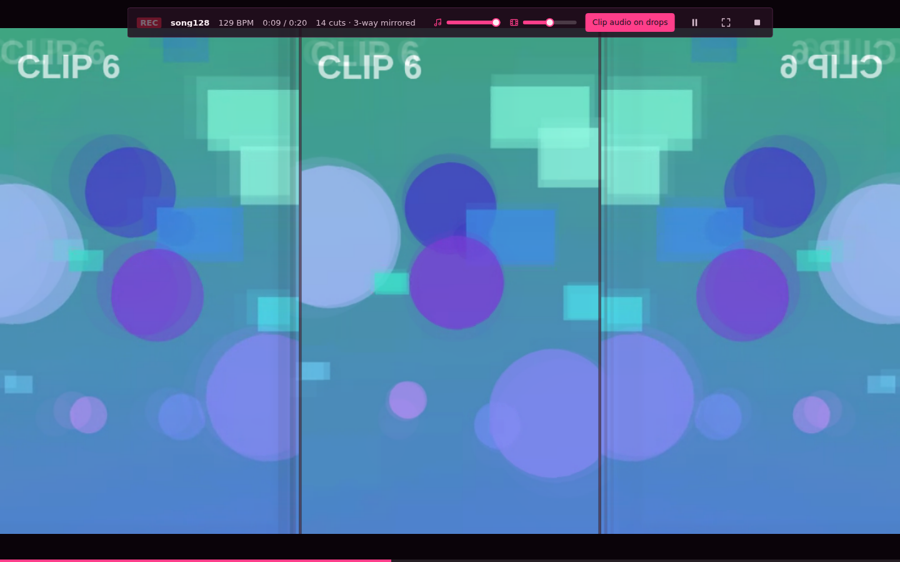

# PMV Generator

Pick a song – on every beat it cuts to a clip from your Stash library: split-screen layouts like real PMVs, effects on cuts, beats and drops, beat-synced speed ramps and clip audio. It runs live in the browser and can record the result as a video and save it back to Stash as a scene. It can also analyze an existing PMV and rebuild it with your own clips.

Works with classic Stash and with the **Stash UI** plugin: with Stash UI installed, the generator shows up in its menu under **Watch**, and its back link and saved scenes lead back into Stash UI.

## Using it

Open it with the **PMV** button in the Stash navbar, from **Watch → PMV Generator** in Stash UI, or directly at `/plugin/pmvGenerator/assets/index.html`. Three steps on the left; on the right the **Go** card with a summary of all settings and the start button (on narrow screens it sticks to the bottom). Every function is its own row with a switch and a short explanation.

1. **Music**: drop or choose a song (MP3, M4A, WAV, OGG, FLAC). Tempo and beats are detected in the browser (under 1 s per minute of music). The waveform shows loudness and bars; if the tempo is off, **½ tempo** / **2× tempo** help, and **Earlier** / **Later** shift the cuts by 20 ms. Or use **PMV as template** (see below).
2. **Clips**
   - **What**: scenes, images or both · **Clip shape**: all, portrait only, landscape only · include/exclude **tags** (right-click) · **Favorites only**.
   - **Folders**: pick one or more folders (searchable, with video/image counts); subfolders are included. Without a choice: all folders.
   - **Clip selection** (one switch each):
     - **Best moments instead of random**: several spots per scene are examined – your scene markers (with a bonus) and random spots – and the one with the most motion, skin and contrast is used. Short clips (under 10 s) start at the beginning.
     - **Smart crop**: when a clip has to be cropped, the crop follows what matters in the picture (skin, edges) instead of sticking to the center; re-measured every 0.4 s and smoothly followed.
     - **Match cuts**: at each cut, the ready clip that best matches the outgoing one in color, brightness and composition (where the subject sits) comes next.
     - **Variety**: the same scene doesn't come back within the last 24 clips, the same performer preferably not within the last 4 (with a small selection it eventually can't be avoided).
3. **Style** – at the top the **mood** (*PMV classic*, *Maximal*, *Hypno*, *Clean* set cutting, layouts and effects in one go), below five tabs:
   - **Cutting**: automatic by energy (calm every 4 beats, medium every 2, loud every beat) or fixed · **Layouts** (split screens like in real PMVs): fullscreen, kaleidoscope, 2-way, **3-way mirrored** (the same clip mirrored left and right, a different one in the middle), 3-way, 4-way. Calm parts stay fullscreen, loud parts switch between the 3-way layouts, drops jump straight into many fields; narrow fields prefer portrait clips · **Fields in 2-/3-way layouts**: side by side or stacked.
   - **Effects**, grouped by occasion, each group with “All on/off”:
     - *On cuts*: transitions (motion blur), zoom-in entry, flash
     - *On the beat*: zoom pulse, shake, **speed ramps** (slow motion in calm parts, faster in loud ones, a burst on drops), stutter, strobe (off by default – careful if you are sensitive to light)
     - *On drops*: RGB split, glitch, tunnel, negative, echo, **text** (your own words in SFX style)
   - **Picture**: **color look** for all clips – Original, Warm, Pink, Cold, Vivid, Black & white, Noir · **Even out brightness** (clips that are too dark get brightened, too bright ones toned down) · color rush, VHS, **image drift** (Ken Burns on still images), **glowing dividers** · format 16:9 or 9:16, fill the picture or fit it completely with a blurred border.
   - **Sound**: sliders for the volume of the **song** and the **clips** (0–100 % each) · **clip audio** on/off · **clip audio plays** *only on drops* (the original audio of the biggest clip fades in for a few beats, like the voice-overs in real PMVs) or *always* (all visible clips play audibly under the song; in split screens they share the clip volume). Everything ends up in the recording exactly like this.
   - **Output**: **intro** (your title slams in on a pink hatched bar, ~3 s) and **outro** (the picture fades dark, title and number of clips, the last second black); title of your choice, empty = song name · **Record** in 720p or 1080p.
4. **Go**: runs as a fullscreen show (Space pause, F fullscreen, Esc stop). The bar at the top lets you adjust the sound live: sliders for **song** and **clips**, and the button next to them cycles clip audio through *off → on drops → always*. This applies right away (including the recording) and is remembered for the next show. With **Record** you get a video (WebM): preview, **Download** or **Save to Stash** – it lands in `<first video library>/PMV Generator`, gets scanned and receives the title “PMV – song” and the tag “PMV Generator”.

Tip: three full-size portrait clips side by side = format **16:9** + layout 3-way + “Portrait only” (each column is then almost exactly 9:16).

## PMV as template

Switch step 1 to **PMV as template**, then pick a PMV from your library (without a search, scenes tagged “PMV” are listed first) or a video file. The analysis runs in the browser at about three times real-time speed:

- **Music** comes from the video's audio track, plus tempo and beats.
- **Cuts**: where the picture changes abruptly – even in just one field of a split screen.
- **Layouts**: dividers running through almost every row (2-/3-/4-way), and exactly mirrored thirds (3-way mirrored) or quarters (kaleidoscope).
- **Flashes**: suddenly very bright frames (white or pink).

A timeline then shows the sections colored by layout (cuts on top, flashes at the bottom). **Rebuild with my clips** plays the original music with the same cuts, layouts and flashes – only with clips from your library (clip selection and effects as usual). Effects like glitch, RGB split or text are burned into the original and can't be recovered; your effects run at the same moments. Stutter jumps in the original are detected as cuts.

Needs a browser with `requestVideoFrameCallback` (Chrome, Edge, current Firefox) and a video the browser can play.

## Requirements

- A current Chrome, Edge or Firefox.
- Saving to Stash uses the small backend `backend.py` (needs `python` in the PATH). With ffmpeg (Stash's own or from the PATH) the recording is remuxed without re-encoding so duration and seeking work – browser recordings otherwise carry no duration.
