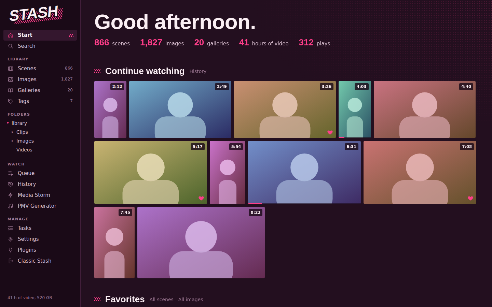
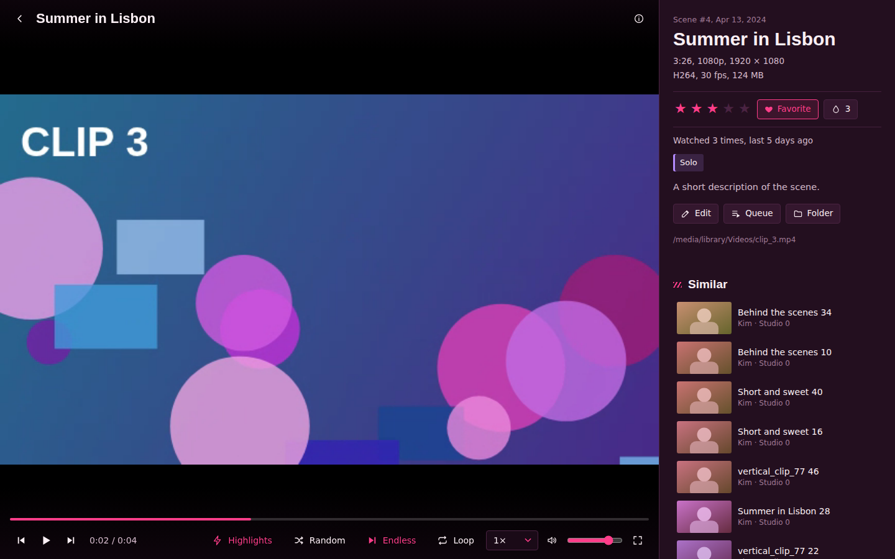

# Stash UI

A complete new interface for [Stash](https://github.com/stashapp/stash), built from scratch in the look of **Media Storm**:

- **Colors**: ink (plum) as the background, paper (blush white) for text, blush pink for actions and favorites, a cool sheen for keyboard focus.
- **Motifs**: blush hatching (////) marks active sections, a halftone screen in the background, messages as speech bubbles, the “STASH” lettering slanted like a sound effect.
- Thumbnails in justified rows (adjustable size); titles and details appear on hover.
- **Heart** = favorite.
- Font: Bahnschrift (included with Windows; other systems fall back to a similar sans-serif).

Open it: just open Stash (e.g. `http://localhost:9999`) – the home page redirects to Stash UI. Directly: `/plugin/stashui/assets/index.html`.

## Sections

| Section | What it does |
|---|---|
| Start | Greeting, figures, continue watching, favorites, recently added, folders, random (“Shuffle”) |
| Search | Across everything: tags, folders, scenes, images, galleries |
| Scenes / Images / Galleries | Justified rows with search, sorting, filters (include/exclude tags, rating, favorites, watched, resolution, duration, format), infinite scrolling, preview video on hover |
| Folders | Every folder with cover images, subfolders and its items; “Include subfolders” shows everything below. The folder tree sits in the navigation on the left. Folders without scenes and images are hidden |
| Tags | List of all tags, tag page with all items, edit/delete tags, create new tags |
| Gallery | All images, slideshow, rating, heart, edit |
| Queue | Play items one after another, reorder by dragging, shuffle |
| History | Everything you've watched, most recent first |
| Media Storm | Opens the Media Storm panel (if the plugin is installed) |
| PMV Generator | Pick a song → beats are detected → live cuts to clips from your library on every beat, with effects; optionally recorded and saved as a scene (see below) |
| Tasks | Scan for new files, generate previews, auto tag, clean – with live progress and stop |
| Settings | All Stash settings in sections: library, previews, playback, paths, login, log (with viewer), classic interface, DLNA, scrapers, more options, database (back up, optimize, clean up), this interface |
| Plugins | On/off, settings, run plugin tasks, reload |
| Classic Stash | The original Stash in the same look, embedded with quick picks: performers, studios, groups, markers, scene tagger, duplicates, scrapers, tools, settings |

## PMV Generator

Under **Watch → PMV Generator**. Three steps on the left; on the right the **Go** card with a summary of all settings and the start button (on narrow screens it sticks to the bottom). Every function is its own row with a switch and a short explanation.

1. **Music**: drop or choose a song (MP3, M4A, WAV, OGG, FLAC). Tempo and beats are detected in the browser (under 1 s per minute of music). The waveform shows loudness and bars; if the tempo is off, **½ tempo** / **2× tempo** help, and **Earlier** / **Later** shift the cuts by 20 ms. Or use **PMV as template** (see below).
2. **Clips**
   - **What**: scenes, images or both · **Clip shape**: all, portrait only, landscape only · include/exclude **tags** (right-click) · **Favorites only**.
   - **Folders**: pick one or more folders (searchable, with video/image counts); subfolders are included. Without a choice: all folders.
   - **Clip selection** (one switch each):
     - **Best moments instead of random**: several spots per scene are examined – your scene markers (with a bonus) and random spots – and the one with the most motion, skin and contrast is used. Short clips (under 10 s) start at the beginning.
     - **Smart crop**: when a clip has to be cropped, the crop follows what matters in the picture (skin, edges) instead of sticking to the center; re-measured every 0.4 s and smoothly followed.
     - **Match cuts**: at each cut, the ready clip that best matches the outgoing one in color, brightness and composition (where the subject sits) comes next.
     - **Variety**: the same scene doesn't come back within the last 24 clips, the same performer preferably not within the last 4 (with a small selection it eventually can't be avoided).
3. **Style** – at the top the **mood** (*PMV classic*, *Maximal*, *Hypno*, *Clean* set cutting, layouts and effects in one go), below five tabs:
   - **Cutting**: automatic by energy (calm every 4 beats, medium every 2, loud every beat) or fixed · **Layouts** (split screens like in real PMVs): fullscreen, kaleidoscope, 2-way, **3-way mirrored** (the same clip mirrored left and right, a different one in the middle), 3-way, 4-way. Calm parts stay fullscreen, loud parts switch between the 3-way layouts, drops jump straight into many fields; narrow fields prefer portrait clips · **Fields in 2-/3-way layouts**: side by side or stacked.
   - **Effects**, grouped by occasion, each group with “All on/off”:
     - *On cuts*: transitions (motion blur), zoom-in entry, flash
     - *On the beat*: zoom pulse, shake, **speed ramps** (slow motion in calm parts, faster in loud ones, a burst on drops), stutter, strobe (off by default – careful if you are sensitive to light)
     - *On drops*: RGB split, glitch, tunnel, negative, echo, **text** (your own words in SFX style)
   - **Picture**: **color look** for all clips – Original, Warm, Pink, Cold, Vivid, Black & white, Noir · **Even out brightness** (clips that are too dark get brightened, too bright ones toned down) · color rush, VHS, **image drift** (Ken Burns on still images), **glowing dividers** · format 16:9 or 9:16, fill the picture or fit it completely with a blurred border.
   - **Sound**: sliders for the volume of the **song** and the **clips** (0–100 % each) · **clip audio** on/off · **clip audio plays** *only on drops* (the original audio of the biggest clip fades in for a few beats, like the voice-overs in real PMVs) or *always* (all visible clips play audibly under the song; in split screens they share the clip volume). Everything ends up in the recording exactly like this.
   - **Output**: **intro** (your title slams in on a pink hatched bar, ~3 s) and **outro** (the picture fades dark, title and number of clips, the last second black); title of your choice, empty = song name · **Record** in 720p or 1080p.
4. **Go**: runs as a fullscreen show (Space pause, F fullscreen, Esc stop). The bar at the top lets you adjust the sound live: sliders for **song** and **clips**, and the button next to them cycles clip audio through *off → on drops → always*. This applies right away (including the recording) and is remembered for the next show. With **Record** you get a video (WebM): preview, **Download** or **Save to Stash** – it lands in `<first video library>/PMV Generator`, gets scanned and receives the title “PMV – song” and the tag “PMV Generator”.

Tip: three full-size portrait clips side by side = format **16:9** + layout 3-way + “Portrait only” (each column is then almost exactly 9:16).

### PMV as template

Switch step 1 to **PMV as template**, then pick a PMV from your library (without a search, scenes tagged “PMV” are listed first) or a video file. The analysis runs in the browser at about three times real-time speed:

- **Music** comes from the video's audio track, plus tempo and beats.
- **Cuts**: where the picture changes abruptly – even in just one field of a split screen.
- **Layouts**: dividers running through almost every row (2-/3-/4-way), and exactly mirrored thirds (3-way mirrored) or quarters (kaleidoscope).
- **Flashes**: suddenly very bright frames (white or pink).

A timeline then shows the sections colored by layout (cuts on top, flashes at the bottom). **Rebuild with my clips** plays the original music with the same cuts, layouts and flashes – only with clips from your library (clip selection and effects as usual). Effects like glitch, RGB split or text are burned into the original and can't be recovered; your effects run at the same moments. Stutter jumps in the original are detected as cuts.

Needs a browser with `requestVideoFrameCallback` (Chrome, Edge, current Firefox) and a video the browser can play.

Saving uses the small backend `backend.py` (needs `python` in the PATH). With ffmpeg (Stash's own or from the PATH) the recording is remuxed without re-encoding so duration and seeking work – browser recordings otherwise carry no duration.

## Player

- Custom controls, timeline with thumbnails on hover, speed, volume, fullscreen.
- Portrait videos (9:16) are fitted completely, nothing is cropped.
- **Resume**: starts where you left off (button “From the start”), saves progress and counts plays like Stash.
- **Random**, **Endless** (continue automatically) and **Loop** as switches; “Up next” in the info bar.
- The info bar on the right (key **I**): rating, heart, O counter (right-click subtracts one), tags, edit, queue, folder.
- **Highlights** (switch in the bar): a heat curve sits above the timeline, diamonds mark the best spots – click or press **J** to jump to the next one. The curve combines two things:
  - **Motion**: from Stash's preview sprites (timeline thumbnails) – how much the picture changes, plus the share of skin. Needs generated sprites (Tasks → Generate previews).
  - **Your watching**: which parts you actually watch and where you seek to. Stored only in this browser (the last 400 scenes).
- **Similar** in the info bar: up to 8 matching scenes – shared performers count most, then studio, share of common tags and the same folder; the best ones are also sorted by the look of the thumbnail (color, brightness, composition). Every suggestion shows the reason (e.g. “3 shared tags”, “similar look”). If a scene has no metadata, only the look decides.

| Key | Player | Image viewer |
|---|---|---|
| Space | Play/pause | Slideshow on/off |
| ← / → | 5 s back/forward (Shift: 30 s) | Previous/next image |
| N / P | Next/previous scene | – |
| J | Next highlight | – |
| 0–9 | Jump to 0–90 % | – |
| 1–5 | Rating | Rating |
| H | Heart (favorite) | Heart (favorite) |
| O | O counter +1 | O counter +1 |
| F | Fullscreen | Fullscreen |
| I | Info bar on/off | Info bar on/off |
| M, ↑/↓ | Mute, louder/quieter | – |
| Z | – | Original size (also double-click; mouse wheel zooms) |
| Esc | Close | Reset zoom, then close |

## Selecting and editing

- The box in the top left of an item, Ctrl+click or Shift+click (range) selects. A bar appears at the bottom: select all, set/remove favorite, edit together (add/remove tags, rating, organized), add to queue, delete (optionally with files).
- Edit a single item: title, rating, heart, tags (including creating new ones), date, description, links, organized, delete.

## Technical notes

- `app/` is the interface (plain JavaScript ES modules, no build step), `classic/` styles classic Stash and redirects the home page.
- **Favorites** = the Stash tag “Favorite” (created with the first heart).
- **Keep the classic home page**: Settings → This interface → “This interface as home page” off (or the plugin setting “Keep classic home page”). For a single tab: `http://localhost:9999/?classic=1`.
- Pages that only exist in classic Stash (registered by other plugins) are embedded through classic Stash; its navigation is hidden there.
- After changing files in `app/`: run `python tools/build.py --sync-only` from the repository root – it copies the shared files to the PMV Generator and Media Storm plugins and sets version stamps so browsers don't load stale files from their cache.
- Classic Stash gets its look directly from this plugin. Other themes that restyle classic Stash may clash with it – turn them off if things look odd.
