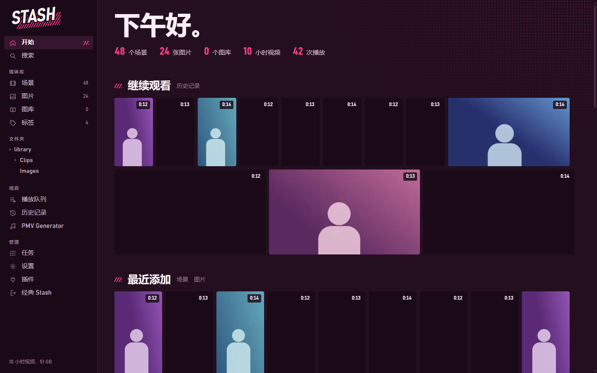

# Stash UI

A complete new interface for [Stash](https://github.com/stashapp/stash), built from scratch in the look of **Media Storm**:

- **Colors**: ink (plum) as the background, paper (blush white) for text, blush pink for actions and favorites, a cool sheen for keyboard focus.
- **Motifs**: blush hatching (////) marks active sections, a halftone screen in the background, messages as speech bubbles, the “STASH” lettering slanted like a sound effect.
- Thumbnails in justified rows (adjustable size); titles and details appear on hover.
- **Heart** = favorite.
- Font: Bahnschrift (included with Windows; other systems fall back to a similar sans-serif).

Open it: just open Stash (e.g. `http://localhost:9999`) – the home page redirects to Stash UI. Directly: `/plugin/stashui/assets/index.html`.


## Sections

| Section | What it does |
|---|---|
| Start | Greeting, figures, continue watching, favorites, recently added, folders, random (“Shuffle”) |
| Search | Across everything: tags, folders, scenes, images, galleries |
| Scenes / Images / Galleries | Justified rows with search, sorting, filters (include/exclude tags, rating, favorites, watched, resolution, duration, format), infinite scrolling, preview video on hover |
| Folders | Every folder with cover images, subfolders and its items; “Include subfolders” shows everything below. The folder tree sits in the navigation on the left. Folders without scenes and images are hidden |
| Tags | List of all tags, tag page with all items, edit/delete tags, create new tags |
| Gallery | All images, slideshow, rating, heart, edit |
| Queue | Play items one after another, reorder by dragging, shuffle |
| History | Everything you've watched, most recent first |
| Media Storm | Opens the Media Storm panel – shown when the Media Storm plugin is installed |
| PMV Generator | Opens the PMV Generator – shown when the PMV Generator plugin is installed |
| Tasks | Scan for new files, generate previews, auto tag, clean – with live progress and stop |
| Settings | All Stash settings in sections: library, previews, playback, paths, login, log (with viewer), classic interface, DLNA, scrapers, more options, database (back up, optimize, clean up), this interface |
| Plugins | On/off, settings, run plugin tasks, reload |
| Classic Stash | The original Stash in the same look, embedded with quick picks: performers, studios, groups, markers, scene tagger, duplicates, scrapers, tools, settings |

## Languages

Stash UI is available in **English** and **Simplified Chinese (简体中文)**. By default it follows the interface language set in Stash (classic Stash → Settings → Interface → Language); you can also pick one under **Settings → This interface → Language**.



### Help translate

Translations live in `app/js/locales/` – one file per language, English text → translation:

```js
export default {
  "Scenes": "场景",
  "{n} days ago": "{n} 天前",
};
```

- Anything missing simply shows in English, so partial translations work.
- `python tools/i18n_keys.py zh-CN` lists the texts a language file is still missing.
- A new language: copy `zh-CN.js`, translate the values, and add it to `LANGS` and `FILES` in `app/js/i18n.js`.
- Found an odd or too long wording? Open an issue or a pull request.

## Works with the other plugins

Stash UI works on its own. If you also install **Media Storm** or the **PMV Generator** (same plugin source), they show up in the menu under **Watch** – entries of plugins that aren't installed or are turned off are hidden. The PMV Generator opens as its own page; its back link and saved scenes lead back into Stash UI.

## Player

- Custom controls, timeline with thumbnails on hover, speed, volume, fullscreen.
- Portrait videos (9:16) are fitted completely, nothing is cropped.
- **Resume**: starts where you left off (button “From the start”), saves progress and counts plays like Stash.
- **Random**, **Endless** (continue automatically) and **Loop** as switches; “Up next” in the info bar.
- The info bar on the right (key **I**): rating, heart, O counter (right-click subtracts one), tags, edit, queue, folder.
- **Highlights** (switch in the bar): a heat curve sits above the timeline, diamonds mark the best spots – click or press **J** to jump to the next one. The curve combines two things:
  - **Motion**: from Stash's preview sprites (timeline thumbnails) – how much the picture changes, plus the share of skin. Needs generated sprites (Tasks → Generate previews).
  - **Your watching**: which parts you actually watch and where you seek to. Stored only in this browser (the last 400 scenes).
- **Similar** in the info bar: up to 8 matching scenes – shared performers count most, then studio, share of common tags and the same folder; the best ones are also sorted by the look of the thumbnail (color, brightness, composition). Every suggestion shows the reason (e.g. “3 shared tags”, “similar look”). If a scene has no metadata, only the look decides.

| Key | Player | Image viewer |
|---|---|---|
| Space | Play/pause | Slideshow on/off |
| ← / → | 5 s back/forward (Shift: 30 s) | Previous/next image |
| N / P | Next/previous scene | – |
| J | Next highlight | – |
| 0–9 | Jump to 0–90 % | – |
| 1–5 | Rating | Rating |
| H | Heart (favorite) | Heart (favorite) |
| O | O counter +1 | O counter +1 |
| F | Fullscreen | Fullscreen |
| I | Info bar on/off | Info bar on/off |
| M, ↑/↓ | Mute, louder/quieter | – |
| Z | – | Original size (also double-click; mouse wheel zooms) |
| Esc | Close | Reset zoom, then close |

## Selecting and editing

- The box in the top left of an item, Ctrl+click or Shift+click (range) selects. A bar appears at the bottom: select all, set/remove favorite, edit together (add/remove tags, rating, organized), add to queue, delete (optionally with files).
- Edit a single item: title, rating, heart, tags (including creating new ones), date, description, links, organized, delete.

## Technical notes

- `app/` is the interface (plain JavaScript ES modules, no build step), `classic/` styles classic Stash and redirects the home page.
- **Favorites** = the Stash tag “Favorite” (created with the first heart).
- **Keep the classic home page**: Settings → This interface → “This interface as home page” off (or the plugin setting “Keep classic home page”). For a single tab: `http://localhost:9999/?classic=1`.
- Pages that only exist in classic Stash (registered by other plugins) are embedded through classic Stash; its navigation is hidden there.
- After changing files in `app/`: run `python tools/build.py --sync-only` from the repository root – it copies the shared files to the PMV Generator plugin and sets version stamps so browsers don't load stale files from their cache.
- **Folders** in the navigation and on the home page need one count of the whole library. The result is remembered in the browser and only counted again when the number of scenes/images changes or after a scan, clean or deletion. On very large libraries you can switch them off under Settings → This interface – folders then only load when you open “Folders”.
- Classic Stash gets its look directly from this plugin. Other themes that restyle classic Stash may clash with it – turn them off if things look odd.
